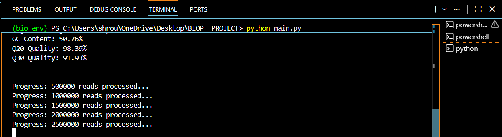
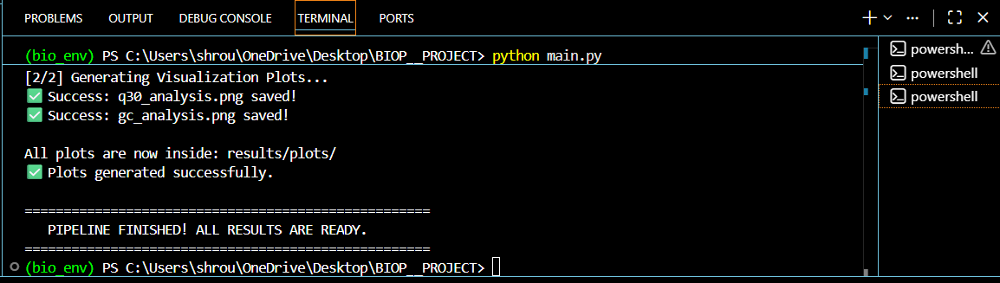

# Cancer vs. Healthy Genomic Data Analysis Pipeline 🧬

## 📋 Project Overview
This project implements a comprehensive Bioinformatics Pipeline for Quality Control (QC) and Filtering of raw genomic data (FASTQ format). The goal is to process high-throughput sequencing reads from both Cancer and Healthy samples, ensuring data integrity before downstream genomic analysis.

## 🛠️ Methodology & Features
The pipeline follows standard genomic processing protocols as discussed in the course modules:
- FASTQ Parsing: Efficient handling of large-scale genomic data using Biopython.
- Quality Filtering (Q20): Systematic removal of low-quality reads (accuracy < 99%) to reduce noise.
- GC Content Analysis: Monitoring DNA stability and checking for potential sample contamination.
- Statistical Reporting: Automated generation of Phred score distributions (Q20/Q30) and read length metrics.

## 📁 Project Structure
The project is organized to separate source code from analysis outputs:

- 📁 **src/**: Contains the core logic (filtering.py) and visualization scripts.
- 📁 **results/report/**: Contains the final numerical outputs:
  - FINAL_QC_REPORT.txt: Detailed base-calling statistics.
  - FINAL_SUMMARY_REPORT.txt: Comparative overview of Cancer vs. Healthy samples.
- 📁 **results/plots/**: Visual evidence of data quality:
  - q30_analysis.png: Comparison of high-quality base percentages.
  - gc_analysis.png: GC content distribution across samain.py **main.py**: The central entry point to execute the full pip.gitignore.gitignore**: Configured to exclude heavy raw data (~GBs) and local environments.

## 📊 Key Findings (Summary)
Based on the processed data, the samples showed the following charactThroughput:hroughput:** Processed over 12.8 Million reads for the CanceQuality:**Quality:** High sequencing acQ30 > 94%*Q30 > 94%** in bothStability:Stability:** GC content remained within the normal h~50%ge (**~50%**), indicating a clean sequencing run.

## 🚀 How to Run
1. Install dependencies: pip install -r requirements.txt
2. Run the main pipeline: python main.py

### Pipeline Execution Preview:
*Processing the genomic data:*

*Execution completed successfully:*

